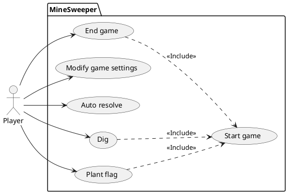

# Cas d'utilisations
1. Au démarrage, le tableau est affiché correspondant à une taille selon les paramètres par défauts.
2. Lorsqu'un premier clic est enregistré sur une case (Joueur ou Auto resolve), toutes les mines sont placées aléatoirement. Seule pour la première case cliquée et ses cases adjacentes sont garanties de ne pas avoir de mine. 
3. Un nombre est attribué à chaque case adjacente d'une mine selon le nombre de mines adjacentes.
4. Le clic gauche sur une case déclenche l'action "*Dig*"
5. Le clic droit sur une case déclenche l'Action "*Plant flag*"
6. Auto resolve résout la partie en entier sans jamais faire d'erreur.
7. Le nombre de mine et la grosseur du tableau sont modifiable.
8. Commencer une partie signifie de réinitialiser toutes les cases. Le placement se fait lors du premier clic mentionné en "*2*"

