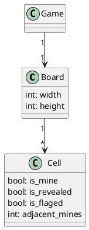

```plantuml
@startuml

class Board{
    int: width
    int: height
}

class Cell{
    bool: is_mine
    bool: is_revealed
    bool: is_flaged
    int: adjacent_mines

}

class Game{

}

Game "1" --> "1" Board
Board "1" --> "*" Cell

@enduml
```